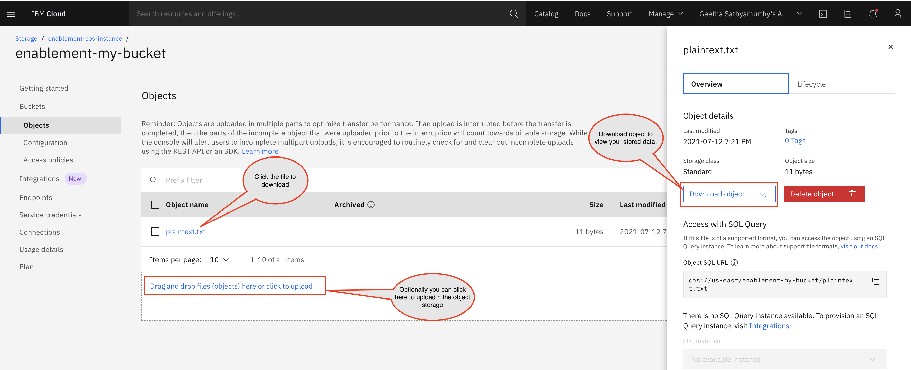

# Create a IBM Cloud Object Storage resource instance

## Use case
A product manager's requirement to his software engineer team is to setup an infrastructure by using IBM Cloud for their client. The infrastructure architecture include one of the requirement to store the unstructured and structured data such as database backup, disk images, media files, PDFs, and large structured datasets.

As a Cloud developer, if you are new to Terraform and IBM Cloud Schematics, you need to develop, configure, and store a sample data file by using IBM Cloud Schematics and Terraform. 

In this use case, you learn the procedure to create any resources or service by using IBM Cloud provide plugin for Terrfaorm.

1. Prerequisities
2. Design the requirement
3. Install Terraform
4. Set up IBM Cloud Provider plug-in version
5. Create and configure the Terraform resource block
6. Execute and verify

## Solution

Complete these procedure for the successful execution of the use case:

### Prequisities

The type of resources you need is IBM Cloud Object Storage. You need the following to get started with IBM Cloud Object Storage:

- An [IBM Cloud Platform](https://cloud.ibm.com/) account
- An instance of IBM Cloud Object Storage in your Lite account plan. If the IBM Cloud Object Storage instance is already created in Lite plan, you can delete 
  -  Log in to the [console](https://cloud.ibm.com/) > Navigation Menu > Resource List > Cloud Object Storage. Click the three dots against your service instance to view and delete the dependencies of your services. Then delete your Cloud Object Storage service instance.

### Design the requirement 


### Install Terraform

1. Create a `terraform` folder on your local machine, and navigate to your `terraform` folder. 
   ```
   mkdir terraform && cd terraform
   ```
   {: pre}
   
2. Download the [Terraform version](https://releases.hashicorp.com/terraform) that you want. The IBM Cloud Provider plug-in for Terraform currently supports Terraform version 0.12.x, 0.13.x, 0.14.x and 0.15.x only. Make sure to select a supported Terraform version. 
3. Extract the Terraform `zip` file and copy the files to your `terraform` directory. 
4. Set the environment `PATH` variable to your Terraform files.
   ```
   export PATH=$PATH:$HOME/terraform
   ```
   {: pre}
   
5. Verify that the installation is successful by using a `terraform` command.
   ```
   terraform
   ```

### Configure IBM Cloud Provider plug-in

After the Terraform CLI installation is complete, you must set up and configure the IBM Cloud Provider plug-in for Terraform so that you can start working with resources and services in IBM Cloud. 

The following steps show how to set up the provider plug-in for Terraform v0.13.x or higher. If you installed or want to use an earlier version of Terraform, refer to [Terraform v0.12](https://cloud.ibm.com/docs/ibm-cloud-provider-for-terraform?topic=ibm-cloud-provider-for-terraform-setup_cli#install-provider-v12).

1. In your Terraform installation directory, create a folder `COSExample` and navigate into the folder. This folder is used to store all configuration files and variable definitions. 
   ```
   mkdir COSExample && cd COSExample
   ```

2. Create a `versions.tf` file with the following content. For a list of supported versions, see the [IBM Cloud Provider plug-in releases](https://github.com/IBM-Cloud/terraform-provider-ibm/releases).

   ```
    terraform {
    required_providers {
        ibm = {
            source = "IBM-Cloud/ibm"
            version = "1.27.1"
            }
        }
    }
   ```

### Create the resource block
Create `main.tf` file in `COSExample` folder, and add the content that are given in the codeblock.

  ```
    resource "ibm_resource_instance" "cos_instance" {
    name              = "enablement-cos-instance"
    service           = "cloud-object-storage"
    plan              = "lite"
    location          = "global"
    }

    resource "ibm_cos_bucket" "cos_bucket" {
    bucket_name           = "enablement-my-bucket"
    resource_instance_id  = ibm_resource_instance.cos_instance.id
    region_location       = "us-east"
    storage_class         = "standard"
    }

    resource "ibm_cos_bucket_object" "plaintext" {
    bucket_crn      = ibm_cos_bucket.cos_bucket.crn
    bucket_location = ibm_cos_bucket.cos_bucket.region_location
    content         = "Hello World"
    key             = "plaintext.txt"
    }

    // This is a API credential block to authenticate your credentials.
    provider "ibm" {
    region           = "us-south"
    ibmcloud_api_key = "<provide your API Key"
    }

    /**  You can try this part of the block to store an object into COS bucket
    resource "ibm_cos_bucket_object" "file" {
    bucket_crn      = ibm_cos_bucket.cos_bucket.crn
    bucket_location = ibm_cos_bucket.cos_bucket.region_location
    content_file    = "${path.module}/helper/object.json"
    key             = "file.json"
    etag            = filemd5("${path.module}/helper/object.json")
    }
    */
  ```

### Execute and verify

From your terminal, change the directory to COSExample folder and execute following command.

Execute `terraform init` to initialize Terraform and plugins. If the Terraform installation or the environment variable for Terraform is not set, you will see `terraform command not found`. To rectify you need to revisit **Install Terraform** and **Configure IBM Cloud Provider plug-in** step.

    ```
    terraform init
    ```

    **Sample output**

    ```
    Initializing the backend...

      Initializing provider plugins...
      - Finding ibm-cloud/ibm versions matching "1.27.1"...
      - Installing ibm-cloud/ibm v1.27.1...
      - Installed ibm-cloud/ibm v1.27.1 (self-signed, key ID AAD3B791C49CC253)

      Partner and community providers are signed by their developers.
      If you'd like to know more about provider signing, you can read about it here:
      https://www.terraform.io/docs/plugins/signing.html

      Terraform has been successfully initialized!

      You may now begin working with Terraform. Try running "terraform plan" to see
      any changes that are required for your infrastructure. All Terraform commands
      should now work.

      If you ever set or change modules or backend configuration for Terraform,
      rerun this command to reinitialize your working directory. If you forget, other
      commands will detect it and remind you to do so if necessary.
    ```

Execute `terraform plan` to validates the syntax of your configuration file and resource definitions against the specifications that are provided by the IBM Cloud Provider plug-in.

    ```
    terraform plan
    ```

   **Sample output**

   ```
   The refreshed state will be used to calculate this plan, but will not be
persisted to local or remote state storage.


  ------------------------------------------------------------------------

   An execution plan has been generated and is shown below.
   Resource actions are indicated with the following symbols:
   + create

   Terraform will perform the following actions:

   # ibm_cos_bucket.cos_bucket will be created
   + resource "ibm_cos_bucket" "cos_bucket" {
         + bucket_name          = "enablement-my-bucket"
         + crn                  = (known after apply)
         + endpoint_type        = "public"
         + force_delete         = true
         + id                   = (known after apply)
         + region_location      = "us-east"
         + resource_instance_id = (known after apply)
         + s3_endpoint_private  = (known after apply)
         + s3_endpoint_public   = (known after apply)
         + storage_class        = "standard"
      }
      Plan: 3 to add, 0 to change, 0 to destroy.

   ------------------------------------------------------------------------

   Note: You didn't specify an "-out" parameter to save this plan, so Terraform
   can't guarantee that exactly these actions will be performed if
   "terraform apply" is subsequently run.
   ```

Execute `terraform apply` to create your resources named **enablement-cos-instance** and **enablement-my-bucket**.  
   
    ```
    terraform apply
    ```
    
   Confirm the creation of resources by entering **yes** when prompted. 

   **Sample output**

   ```
   Do you want to perform these actions?
  Terraform will perform the actions described above.
  Only 'yes' will be accepted to approve.

  Enter a value: yes

   ibm_resource_instance.cos_instance: Creating...
   ibm_resource_instance.cos_instance: Still creating... [10s elapsed]
   ibm_resource_instance.cos_instance: Still creating... [20s elapsed]
   ibm_resource_instance.cos_instance: Creation complete after 27s [id=crn:v1:bluemix:public:cloud-object-storage:global:a/96ee4d5ceb9116e5924ba4a883362490:2980b271-4ce8-4e38-a9f9-a0f9ed1f2295::]
   ibm_cos_bucket.cos_bucket: Creating...
   ibm_cos_bucket.cos_bucket: Creation complete after 7s [id=crn:v1:bluemix:public:cloud-object-storage:global:a/96ee4d5ceb9116e5924ba4a883362490:2980b271-4ce8-4e38-a9f9-a0f9ed1f2295:bucket:enablement-my-bucket:meta:rl:us-east:public]
   ibm_cos_bucket_object.plaintext: Creating...
   ibm_cos_bucket_object.plaintext: Creation complete after 3s [id=crn:v1:bluemix:public:cloud-object-storage:global:a/96ee4d5ceb9116e5924ba4a883362490:2980b271-4ce8-4e38-a9f9-a0f9ed1f2295:bucket:enablement-my-bucket:object:plaintext.txt:location:us-east]

   Apply complete! Resources: 3 added, 0 changed, 0 destroyed.
   ```
#### Verify

You can verify your IBM Cloud Object Storage resource is created through command line and console.

**Command line**

Execute `terraform show` to list the applied changes in your environment.

   ```
   terraform show
   ```

Optionally: Execute `terraform destroy` to destroy the resources.

   ```
   terraform destroy
   ```

**Console**

The steps to view your resource and object in the object storage:

1. Log in to the [IBM Cloud console](https://cloud.ibm.com).
2. Click **Navigation Menu > Resource list > Storage** to view your `enablement-cos-instance` resource instance.
3. Click enablement-cos-instance to view **Buckets**
4. Click enablement-my-bucket to view **Object** page with the list of your file details. 
5. Click the file name to view the data, as shown in the screen capture.
   
6. Optionally, you can Drag and drop files to upload in your bucket.

## What's next?

- Explore IBM Cloud Object Storage by using Terraform, by referring to [IBM Cloud Object Storage](https://github.com/IBM-Cloud/terraform-provider-ibm/tree/master/examples/ibm-cos-bucket-object).
- More Terraform attributes and arguments related to IBM Cloud Object Storage, refer to [Terraform Object Storage resources and data sources](https://registry.terraform.io/providers/IBM-Cloud/ibm/latest/docs/resources/cos_bucket).


For more information, about IBM Cloud Object Storage, see [Upload data](https://cloud.ibm.com/docs/cloud-object-storage?topic=cloud-object-storage-upload).
