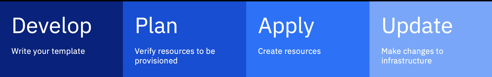

# Deploying IBM Cloud platform and infrastructure services with Schematics workspaces

Learn how to use the Terraform capabilities in Schematics to deploy IBM Cloud services in your IBM Cloud account. 

This lesson cover: 
- What is Terraform? 
- What is the IBM Cloud Provider for Terraform? 
- What are Schematics workspaces?
- How do workspaces work? 
- What is needed to use Schematics workspaces?
- Maybe: Reference to Terraform resources/ data sources
- Maybe: Reference to Terraform Provider releases
- Lab exercise: Demonstrate how to create a Schematics workspace. 
  - Suggestion for free example: Create a COS service instance and bucket
  - Suggestion for real world example (will cost money): Setup bastion host and a VSI (we can reuse this infrastructure to then install the LAMP stack with Ansible in a later lab)

## What is Terraform?
[Terraform](https://terraform.io/) is an open source project that lets you specify your cloud infrastructure resources and services by using a high-level scripting language. Your specification is stored in a Terraform configuration file. In order to abstract the APIs and complexity of the cloud resource provisioning and management process to the user, cloud providers create a plug-in for Terraform that contains the information for how to connect to the cloud provider and what APIs to call to work with a certain cloud resource. IBM's plug-in is called the IBM Cloud Provider plug-in for Terraform.

### Terraform properties

## What is IBM Cloud provider for Terraform?

## What are Schematics workspaces
Schematics workspaces deliver Terraform-as-a-Service capabilities to you so that you can automate the provisioning and management of your IBM Cloud resources, and rapidly build, duplicate, and scale complex, multi-tier cloud environments.

Simply create a workspace in Schematics and import the Terraform configuration files that you want to run. The IBM Cloud Provider plug-in analyzes the Terraform resources that you specified and determines the order in which these resources must be provisioned, including any dependencies that must be considered.

## What do I need to get started? 

To start provisioning IBM Cloud services with Schematics and Terraform, you need: 

- **IBM Cloud account**: Register for an IBM Cloud account or use an existing IBM Cloud account. 
- **Schematics permissions**: 

