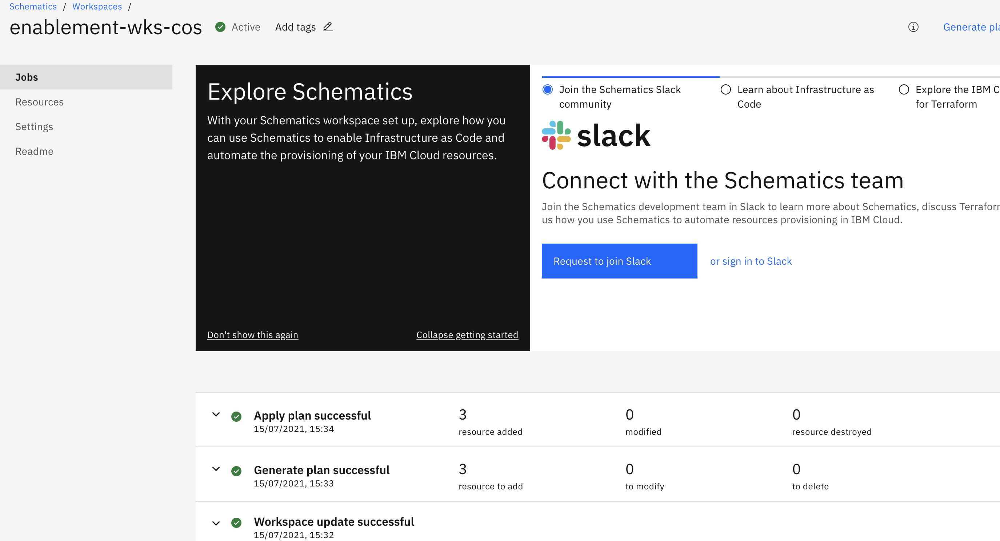

# Create a IBM Cloud Object Storage resource instance

## Use case
A product manager's requirement to his software engineer team is to setup an infrastructure by using IBM Cloud for their client. The infrastructure architecture include one of the requirement to store the unstructured and structured data such as database backup, disk images, media files, PDFs, and large structured datasets.

As a Cloud developer, if you are new to Terraform and IBM Cloud Schematics, you need to develop, configure, and store a sample data file by using IBM Cloud Schematics and Terraform. 

In this use case, you learn the procedure to create IBM Cloud Object Storage resources by using IBM Cloud Schematics.

1. Prerequisities
2. Design the requirement
3. Install Terraform
4. Set up IBM Cloud Provider plug-in version
5. Create and configure the Terraform resource block
6. Execute and verify

## Solution

Complete these procedure for the successful execution of the use case:

### Prequisities

You have an IBM Cloud account with right account plan, by default all the new IBM Cloud user will have **Lite** account plan, where you can test few resources and later upgrade your plan. Complete the following prequisities.

- An [IBM Cloud Platform](https://cloud.ibm.com/) account.
- Create an API_Key. Store this API key for your exercise.
- An instance of IBM Cloud Object Storage in your Lite account plan. If the IBM Cloud Object Storage instance is already created in Lite plan, you can delete 
  -  Log in to the [console](https://cloud.ibm.com/) > **Navigation Menu** > **Resource List** > **Cloud Object Storage**. Click the three dots against your service instance to view and delete the dependencies of your services. Then delete your Cloud Object Storage service instance.

### Design the requirement 

### Configure the Terraform files

The Git url https://github.com/geethasathyamurthy/schematics-enablement/examples/cos contains the Terraform configuration file such as:
**main.tf** : Contains the IBM Cloud Object Storage configuration, here you need to provide you API key.
**version.tf** : Contains the IBM Cloud Provider release version you are applying. See releases for more information.

### Create the Schematics workspace

1. Open the [Schematics workspace create page](https://cloud.ibm.com/schematics/workspaces/create). 
2. Enter a name for your workspace. The name can be up to 128 characters long and can include alphanumeric characters, spaces, dashes, and underscores.
3. Optional: Enter tags for your workspace. You can use the tags later to find your workspace more easily.
4. Select the resource group where you want to create the workspace. Default resource group is `default`.
5. Decide where you want to create your workspace. The location determines where your Schematics jobs run and your workspace data is stored. 
6. Optional: Enter a descriptive name for your workspace. 
7. Click **Create** to create your workspace. Your workspace is created with a **Draft** state and the workspace **Settings** page opens.

### Importing your Terraform template

1. On the workspace **Settings** page, enter the link to your `Git` repository as https://github.com/geethasathyamurthy/schematics-enablement/examples/cos.
2. Optional: If you want to use a private Git repository, enter your personal access token. The personal access token is used to authenticate with your Git repository to access your Terraform template.
3. Select the **Terraform version_13** that your Terraform configuration files are written in.
4. Click **Save template information**. Schematics automatically downloads the Terraform configuration files from your repository, scans them for syntax errors, and retrieves all input variables that you declared in your configuration files. When all configuration files are downloaded successfully and no syntax errors are found, the workspace state changes to **Inactive**. Our example do not have input variable values.
5. Click **Generate plan** to validate the syntax of your configuration file and resource definitions against the specifications that are provided by the IBM Cloud Provider plug-in.
6. Click **Apply plan** to create your resources named **enablement-cos-instance** and **enablement-my-bucket**. 

### Analyze

The steps to view your resource and object in the object storage:

1. Log in to the [IBM Cloud console](https://cloud.ibm.com).
2. Click **Navigation Menu > Resource list > Storage** to view your `enablement-cos-instance` resource instance.
3. Click enablement-cos-instance to view **Buckets**
4. Click enablement-my-bucket to view **Object** page with the list of your file details. 
5. Click the file name to view the data, as shown in the screen capture.
   
6. Optionally, you can Drag and drop files to upload in your bucket.

## What's next?

- Explore IBM Cloud Object Storage by using Terraform, by referring to [IBM Cloud Object Storage](https://github.com/IBM-Cloud/terraform-provider-ibm/tree/master/examples/ibm-cos-bucket-object).
- More Terraform attributes and arguments related to IBM Cloud Object Storage, refer to [Terraform Object Storage resources and data sources](https://registry.terraform.io/providers/IBM-Cloud/ibm/latest/docs/resources/cos_bucket).

For more information, about IBM Cloud Object Storage, see [Upload data](https://cloud.ibm.com/docs/cloud-object-storage?topic=cloud-object-storage-upload).
